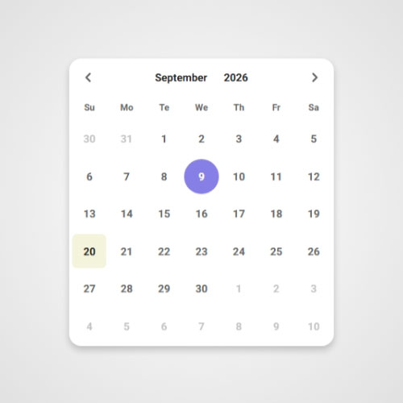
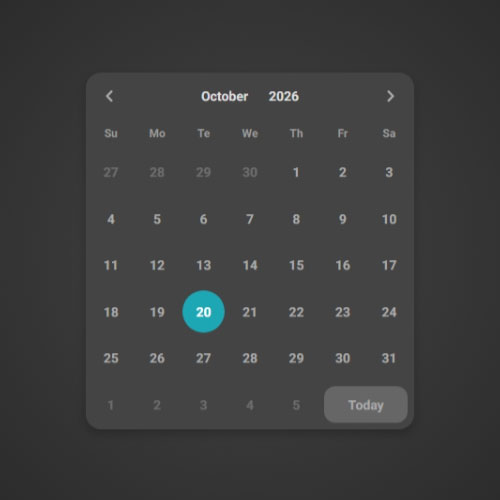
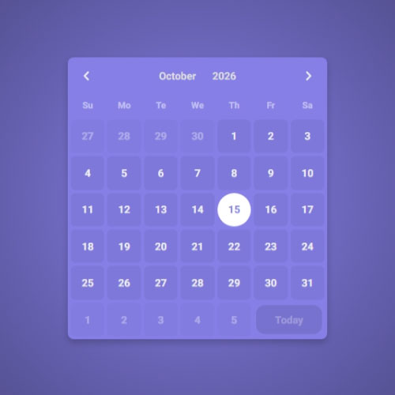
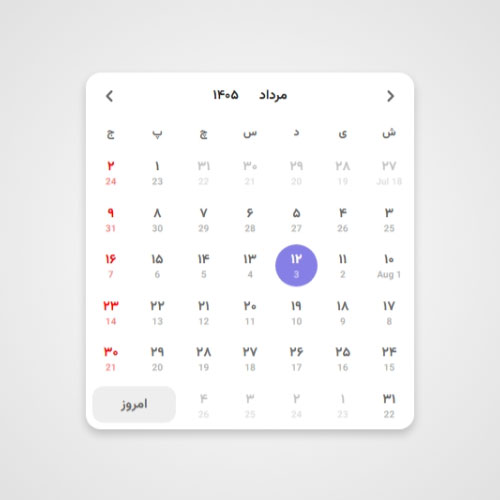
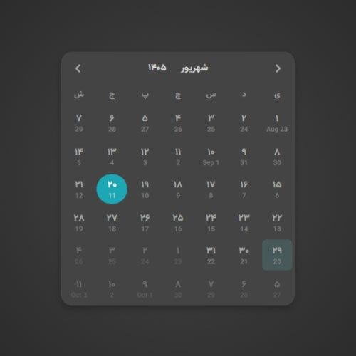
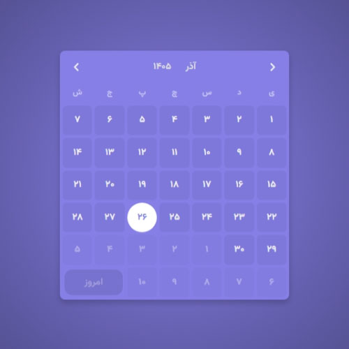

# 🗓️ pyno-datepicker

A modern, standalone Angular datepicker component built entirely with Angular signals. It supports both Persian (Jalali/Shamsi) and Gregorian calendars, and can display a second calendar alongside the primary one — letting users see equivalent dates in both systems at a glance. With an inline or popup mode, a custom trigger element, and a flexible output that can be either a structured object or a formatted string, it adapts to a wide range of use cases. It's fully typed, tree-shakable, and designed for Angular 17+ applications.

---
## 📦 Installation
This package requires **pyno-date** as a peer dependency. Install both together:
```bash
npm install pyno-date pyno-datepicker
```
> Make sure `pyno-date` is installed in the same project, otherwise the datepicker will not work.

---
## 📸 Screenshots
  
---
  

## ✨ Features

### 🗓️ Dual Calendar Support
- **Gregorian** and **Persian (Jalali/Shamsi)** calendars out of the box.
- Switch between calendars with a single input.
- Automatic **RTL layout** for the Jalali calendar.
- Optional **second calendar** display alongside the primary one — each day shows the equivalent date in the other calendar system.

### ⚡ Built with Angular Signals
- Entire component state managed with **Angular signals** (`signal`, `computed`, `input`, `output`).
- Fully **standalone** — no NgModule required.
- Reactive and efficient change detection.
- Modern Angular 17+ API (`input()`, `output()`).

### 🎛️ Three View Modes
- **Days view** – classic month grid with 42 cells.
- **Months view** – click the month name in the header to pick a month.
- **Years view** – paginated year selector (25 years per page) with next/previous navigation.

### 🔄 Inline & Popup Modes
- **Inline mode** – embed the calendar directly in the page.
- **Popup mode** – attach to any element via `triggerFor` and open on click.
- Click-outside overlay to close the popup.

### 🎨 Flexible Output
- Return the selected date as either a **structured object** (`PynoDatepickerDateObject`) or a **formatted string**.
- Custom date format via the `format` input.
- Separate `onInit` and `onSelect` outputs.

### 🌐 Full Localization Support
- Customize the **first day of the week** via `setFirstDayOfWeek()`.
- Override **weekday names** via `setWeekdayName()`.
- Override **month names** via `setMonthName()`.
- Custom label for the "Today" button via `todayBtnText`.

```typescript
this.pynoDatepicker.setFirstDayOfWeek('sunday');
this.pynoDatepicker.setWeekdayName('gregorian', 'saturday', 'Sat');
this.pynoDatepicker.setMonthName('gregorian', 9, 'Sep');
```

### 🎯 Rich Inputs

| Input | Type | Description                              |
|-------|------|------------------------------------------|
| `triggerFor` | `HTMLElement` | Element that opens the popup.            |
| `inline` | `boolean` | Render inline instead of popup.          |
| `initValue` | `string` | Initial selected date.                   |
| `secondCalendar` | `boolean` | Show the opposite calendar's day values. |
| `calendar` | `'gregorian' \| 'jalali'` | Primary calendar system.                 |
| `format` | `string` | Date format string. See [pyno-date](https://www.npmjs.com/package/pyno-date) for available format tokens.                     |
| `outputAs` | `'object' \| 'string'` | Output shape.                            |
| `todayBtnText` | `string` | Label for the today button.              |

### 📤 Outputs

| Output | Payload | Description |
|--------|---------|-------------|
| `onInit` | `PynoDatepickerDateObject \| string \| null` | Emitted on initialization. |
| `onSelect` | `PynoDatepickerDateObject \| string \| null` | Emitted when the user picks a date. |

### ✨ UX Highlights
- Highlighted **today** and **selected date**.
- Visual distinction for **previous-month** and **next-month** days.
- Smooth enter/leave animations (`animate.enter`, `animate.leave`).
- "Today" shortcut button that jumps back to the current month.
- Fully typed API with exported interfaces and union types.

### 🧩 Service API (`PynoDatepickerService`)
- Injectable, tree-shakable, `providedIn: 'root'`.
- Public methods for customization:
  - `setFirstDayOfWeek(day)`
  - `setWeekdayName(calendar, weekday, name)`
  - `setMonthName(calendar, month, name)`
- Built-in month and weekday name dictionaries for both calendars.

## 🎨 Styling & Theming

`pyno-datepicker` is fully themeable through **CSS custom properties** and **class overrides**, giving you complete control over its appearance without touching the library's source.

### CSS Variables
All colors, spacing, radii, shadows, and transitions are exposed as CSS variables on the `:host`. Override any of them in your own stylesheet to instantly re-skin the datepicker:
### Class Overrides
Every part of the datepicker has its own dedicated class (topbar, weekdays, days, months, years, today button, etc.). If CSS variables aren't enough, you can target any of these classes directly to fully customize the layout and presentation.

Combined, these two layers let you go from a simple color tweak to a completely custom-looking datepicker.

---

## 🧠 License

MIT

Designed & developed by [Amir Navidfar](https://github.com/amirhsnf)
